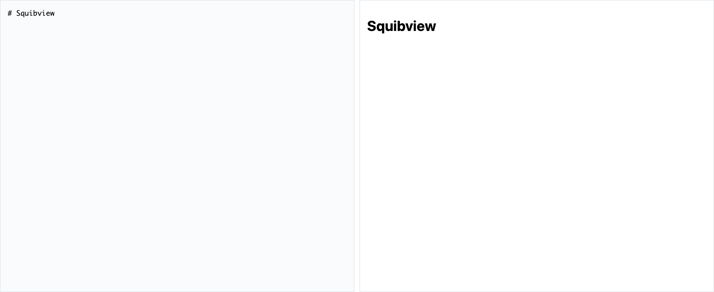

# SquibView

[](https://www.npmjs.com/package/squibview)
[](LICENSE)
[](https://github.com/deftio/squibview/actions/workflows/ci.yml)

Squibview is a markdown editor/viewer (pure js) with live preview, bidirectional editing, and rich content support (code highlighting, diagrams, math, maps, csv/psv/tsv, 3D and more).  It can be used as markdown editor or viewer in many projects or to view AI/LLM outputs interactively.  In headless mode squibview can be used as a lightweight viewer with the full support of markitdown and turndown libaries.  

For a lightweight pure js bidirectional parser/editor consider it's sister project [quikdown](https://github.com/deftio/quikdown) which has no dependancies and starts at 9-15KB with some limits on less used commond mark features.

**GitHub:** [**Live Demo**](https://deftio.github.io/squibview/examples/example_ESM.html) | [**Examples**](https://deftio.github.io/squibview/examples/) | [**Documentation**](https://deftio.github.io/squibview/docs/home.html) | [**API Reference**](https://deftio.github.io/squibview/docs/programmers-guide.html)  
**Local:** [**Live Demo**](./examples/example_ESM.html) | [**Examples**](./examples/) | [**Documentation**](./docs/) | [**Source**](./src/)



## What It Does

SquibView renders Markdown (or HTML) with live preview and allows editing in both source and rendered views. Changes sync automatically between views.

**Key Capabilities:**
- Edit markdown and see live HTML preview
- Edit in the rendered view - changes reflect back to markdown
- Full revision history with undo/redo
- Visual diff comparison between any revisions
- Export/copy as HTML with embedded images (including diagrams, pics, maps, 3D, editable tables and source code)
- Works as CLI tool or JavaScript component
- Streaming support for use with LLMs 
- Examples with Vue and React in addition to pure js

**Supported Content:**
- 📊 Mermaid diagrams, flowcharts, sequence diagrams
- 🗺️ GeoJSON/TopoJSON interactive maps
- 🧮 LaTeX math equations
- 📐 STL 3D models
- 📈 CSV/TSV tables
- 🎨 SVG graphics
- 🖼️ Images with base64 conversion
- 💻 Syntax-highlighted code

## Quick Start

### Browser - Zero Configuration Quick Start
The easiest way to get started - with fence libraries (math, mermaid, etc) loading automatically from CDN when your content needs them.  Note that special care is taken to not load dependancies that may have already been provisioned so there is no double-loading.

```html
<!-- SquibView CSS -->
<link rel="stylesheet" href="https://unpkg.com/squibview/dist/squibview.min.css">

<script type="module">
  import SquibView from 'https://unpkg.com/squibview/dist/squibview.esm.min.js';

  const editor = new SquibView('#editor', {
    initialContent: '# Hello\nStart typing **markdown**...\n\n```mermaid\ngraph TD\n  A --> B\n```',
    autoload_deps: { all: true }  // Enable autoloading of fence libraries (mermaid, math etc)
  });
</script>

<div id="editor"></div>
```

With the autoload_deps config Mermaid, syntax highlighting, math rendering, and maps load automatically when you use them.  If you need more finegrain control our are using other libraries for rendering math/diagrams/etc leave autoload_deps off (default) and load your own libraries.  See examples for more.

For those running in air_gapped or offline environments use the standalone builds (see docs) which have all major fences (mermaid, mathjax, threejs, etc) bundled in (note these buidls are 3.6MB).

### NPM Install
```bash
npm install squibview
```

```javascript
import SquibView from 'squibview';

// With autoload (recommended)
const editor = new SquibView('#editor', {
  autoload_deps: { all: true }
});

// Or manually manage dependencies
const editor = new SquibView('#editor', {
  autoload_deps: null  // Load dependencies yourself
});
```

### CLI Tool

SquibView includes a command line tool (`squibv`) for converting markdown/HTML files to standalone HTML pages.  

```bash
# Convert markdown to HTML page
npx squibv document.md

# Watch mode - rebuilds on file changes
npx squibv document.md --watch

# Bundle for offline use (embeds all assets)
npx squibv document.md --bundle-offline
```

## Core Features

### View Modes
```javascript
editor.setView('split');  // Side-by-side editing (default)
editor.setView('src');    // Source only
editor.setView('html');   // Rendered only
```

### Working with Content
```javascript
// Set markdown content
editor.setContent('# My Document\n\nEdit this text...', 'md');

// Get current content
const markdown = editor.getContent();
const html = editor.getRenderedHTML();
```

### Revision History & Diffs
```javascript
editor.revisionUndo();
editor.revisionRedo();

// Compare revisions (v1.0.13+)
const diffHTML = editor.getSourceDiffHTML({ fromIndex: 0, toIndex: 2 });
const inlineDiff = editor.getSourceDiffInline(); // Blue additions, red deletions
```

### Export & Copy
```javascript
editor.copySource();   // Copy markdown to clipboard
editor.copyHTML();     // Copy rendered HTML
editor.exportHTML();   // Download as file
```

## Examples

**Live Examples** (GitHub Pages)
- [Basic Usage](https://deftio.github.io/squibview/examples/example_autoload_simple.html) - Simple editor setup
- [Headless Mode](https://deftio.github.io/squibview/examples/example_headless.html) - Custom UI with full API
- [Diff Viewer](https://deftio.github.io/squibview/examples/diff_view_inline.html) - Compare revisions
- [Live Diff](https://deftio.github.io/squibview/examples/diff_view_live.html) - Track changes in real-time
- [React Integration](https://deftio.github.io/squibview/examples/example_react.html) - Use with React

**Local Examples** (after cloning repo)
- [Basic Usage](./examples/example_autoload_simple.html)
- [Headless Mode](./examples/example_headless.html)
- [Diff Viewer](./examples/diff_view_inline.html)
- [Live Diff](./examples/diff_view_live.html)
- [All Examples](./examples/index.html)

## Documentation

**Complete Documentation**
- [📚 Full Documentation](docs/) - All documentation in organized structure
- [API Reference](docs/api/) - Comprehensive API documentation
- [Programmer's Guide](docs/programmers-guide.md) - Detailed usage guide
- [Headless Mode Guide](docs/guides/headless-mode.md) - Using SquibView without built-in UI
- [CLI Documentation](docs/cli/CLI.md) - Command line interface guide
- [Examples](examples/) - Live examples and demos
- [Release Notes](docs/release-notes.md) - Version history and changelog

**Local Documentation** (after cloning)
- [Documentation Home](./docs/home.html)
- [API Reference](./docs/programmers-guide.html)
- [Release Notes](./docs/release-notes.md)

## Build Options

**All builds include integrated autoload capability (v1.0.18+). Each configuration is available in both ESM (for modern bundlers) and UMD (for script tags) formats:**

| Configuration | What It Does | Best For | Size (minified) | What's Included |
|--------------|--------------|----------|-----------------|------------------|
| **Standard** 🚀 | Recommended - includes autoload | Most projects | 254KB | Core editor with autoload capability for all features |
| **Lean** | Minimal - you add libraries | Custom bundlers | 135KB | Editor only - bring your own libraries |
| **Standalone** | Everything pre-bundled | Offline use | 3.5MB | Everything included - no external dependencies |


### Quick Selection Guide

- **Want it to just work?** → Use **Standard** with `autoload_deps: { all: true }` - Features load automatically
- **Custom build setup?** → Use **Lean** (`squibview.esm-lean.min.js`) - You control all dependencies
- **Offline/airgapped?** → Use **Standalone** (`squibview.standalone.esm.min.js`) - Everything included (3.6MB)

### Complete File List

| File | Module Format | Configuration | Size (minified) |
|------|--------------|---------------|-----------------|
| `squibview.esm.min.js` | ESM | Standard | 254KB |
| `squibview.umd.min.js` | UMD | Standard | 255KB |
| `squibview.esm-lean.min.js` | ESM | Lean | 135KB |
| `squibview.umd-lean.min.js` | UMD | Lean | 137KB |
| `squibview.standalone.esm.min.js` | ESM | Standalone | 3.5MB |
| `squibview.standalone.umd.min.js` | UMD | Standalone | 3.7MB |
| `squibview.min.css` | - | Required for all | 23KB |

> **v1.0.15+**: Default builds now include markdown-it, diff-match-patch, and tiny-emitter bundled. Use `-lean` builds if you need the old behavior.

### Autoload Configuration (v1.0.18+)

All SquibView builds now include autoload capability. Enable it with the `autoload_deps` option:

```javascript
// Enable autoloading for all libraries
const editor = new SquibView('#editor', {
  autoload_deps: { all: true }
});

// Fine-grained control
const editor = new SquibView('#editor', {
  autoload_deps: {
    mermaid: 'ondemand',    // Load when mermaid blocks detected
    hljs: 'auto',           // Load immediately on init
    mathjax: false,         // Never load (disable)
    leaflet: 'ondemand',    // Load when map blocks detected
    three: 'ondemand'       // Load when STL blocks detected
  }
});
```

#### What Gets Auto-Loaded When Needed:

| When you type... | What loads | For |
|------------------|------------|-----|
| ` ```mermaid ` | Mermaid (377KB) | Diagrams, flowcharts, graphs |
| ` ```javascript ` | Highlight.js (45KB) | Syntax highlighting for code |
| `$$x^2$$` or ` ```math ` | MathJax (1.3MB) | Mathematical equations |
| ` ```geojson ` | Leaflet (142KB) | Interactive maps |
| ` ```stl3d ` | Three.js (1.1MB) | 3D model viewing |

#### Advanced Configuration

Control loading behavior per library:

```javascript
const editor = new SquibView('#editor', {
  autoload_deps: {
    // Loading strategies: 'auto' | 'ondemand' | false | function
    mermaid: 'auto',        // Load immediately on init
    hljs: 'ondemand',       // Load when code blocks are detected (default)
    mathjax: false,         // Never load
    leaflet: 'ondemand',    // Load when map blocks detected
    three: myCustomLoader,  // Use custom loading function

    // Use custom CDN
    cdnUrls: {
      mermaid: {
        script: 'https://cdn.jsdelivr.net/npm/mermaid@10/dist/mermaid.min.js'
      }
    },

    // Enable debug logging (silent by default)
    debug: true  // Shows library loading in console
  }
});
```

### Standalone Build - Best for Offline/Secure Environments

The standalone build (`squibview.standalone.*.js`) bundles everything:
- **Largest size** - ~3.7MB includes all libraries
- **Works offline** - No external dependencies
- **Corporate friendly** - No CDN calls, perfect for secure environments
- **Everything included** - All features work immediately

## License

BSD-2-Clause. See [LICENSE](LICENSE).