# SquibView Live Demo

> **Recording Instructions:**
> 1. Start with empty editor, type content step by step
> 2. Show live preview updating in real-time
> 3. Demonstrate bidirectional editing by clicking in rendered view
> 4. Keep each section brief for GIF timing

## ⚡ Real-time Markdown
Type this text and watch it render instantly:

**Bold text**, *italic text*, and `inline code` all update live!

---

## 📊 Live Mermaid Diagrams
Watch this diagram build as you type:

```mermaid
graph TD
    A[User Types] --> B{SquibView}
    B -->|Instantly| C[Beautiful Diagrams]
    B -->|Real-time| D[Live Preview]
    C --> E[🎉 Amazing Results]
    D --> E
```



---

## 🧮 LaTeX Math Equations
Mathematical beauty in real-time:

Inline math: $E = mc^2$

Block equations:
$$\sum_{i=1}^{n} x_i = \frac{n(n+1)}{2}$$

Complex formulas:
$$\int_{-\infty}^{\infty} e^{-x^2} dx = \sqrt{\pi}$$

---

## 🗺️ Interactive GeoJSON Maps
Geographic data that comes alive:

```geojson
{
  "type": "FeatureCollection",
  "features": [
    {
      "type": "Feature",
      "properties": {
        "name": "San Francisco",
        "description": "Tech Hub"
      },
      "geometry": {
        "type": "Point",
        "coordinates": [-122.4194, 37.7749]
      }
    },
    {
      "type": "Feature", 
      "properties": {
        "name": "New York",
        "description": "Finance Center"
      },
      "geometry": {
        "type": "Point",
        "coordinates": [-74.0059, 40.7128]
      }
    }
  ]
}
```

---

## 🎯 Syntax Highlighted Code
Perfect for technical documentation:

```javascript
// SquibView integration example
const editor = new SquibView({
  element: document.getElementById('editor'),
  content: '# Hello **SquibView**!',
  initialView: 'split'
});

// Watch the magic happen
editor.setContent(newMarkdown);
```

```python
# Data science example
import pandas as pd
import matplotlib.pyplot as plt

def analyze_data(df):
    """Real-time documentation with SquibView"""
    return df.describe()
```

---

## 📋 Tables & Data
Structured data made beautiful:

| Feature | SquibView | Competitors |
|---------|-----------|-------------|
| Live Preview | ✅ Instant | ❌ Slow |
| Rich Content | ✅ Full Support | ❌ Limited |
| Bidirectional | ✅ Yes | ❌ No |
| Offline Ready | ✅ Yes | ❌ CDN Only |

---

## 🔄 Bidirectional Editing Demo
**Try this in the GIF:**
1. Type content in source editor
2. Click on rendered text to edit directly
3. Show changes syncing back to source
4. Demonstrate the magic of two-way editing!

> **Pro tip:** Click on any rendered text to edit it directly!

---

## 🎨 Rich Content Showcase
Everything works together seamlessly:

### Mixed Content Example:
The formula for compound interest is: $A = P(1 + r)^t$


**Result:** Beautiful, interactive documentation that updates in real-time!

---

## 🚀 Ready to Use SquibView?

Visit: [SquibView on GitHub](https://github.com/deftio/squibview)

```bash
# Get started in seconds
npx squibv your-document.md
```

*End of demo content - perfect for showcasing SquibView's power!*
