# SquibView - Live Bidirectional Markdown Editor

[](https://www.npmjs.com/package/squibview) [](LICENSE) [](https://github.com/deftio/squibview/actions/workflows/ci.yml) [](https://www.npmjs.com/package/squibview)

**True bidirectional markdown editing** - edit source OR rendered view, changes sync instantly. Perfect for AI/LLM content with rich formatting, diagrams, math, and data tables.

**[🚀 Live Demo](https://deftio.github.io/squibview/examples/example_ESM.html)** • **[📦 Quick Start](#quick-start)** • **[🔧 Examples](./examples/)**

```mermaid
graph LR
    A[📝 Markdown] <--> B[👀 Live Preview]
    B <--> C[🎯 True Bidirectional]
    C --> D[🚀 Ship It!]
    
    style A fill:#e1f5fe
    style B fill:#f3e5f5  
    style C fill:#e8f5e8
    style D fill:#fff3e0
```



**Rich Content Examples:**

**Math Support:** $$E = mc^2$$

**Data Tables:**
```csv
Name,Role,Status
Alice,Developer,Active
Bob,Designer,Active
Charlie,Manager,Active
```

## Core Features

- **🔄 True Bidirectional** - Edit in markdown OR rendered view
- **🎨 Rich Content** - Mermaid diagrams, LaTeX math, SVG graphics, CSV tables
- **🤖 AI/LLM Perfect** - Handle complex ChatGPT/Claude output formatting  
- **📦 Headless Design** - Embed anywhere, framework-agnostic
- **⚡ Multiple Builds** - ESM (115KB), UMD (118KB), Standalone (2.7MB)
- **🔌 Plugin System** - Custom renderers and content types
- **📱 Responsive** - Works on desktop, tablet, mobile

## Quick Start

**30-second setup with standalone build:**

```html
<!DOCTYPE html>
<html>
<head>
    <link rel="stylesheet" href="https://unpkg.com/squibview/dist/squibview.css">
</head>
<body>
    <div id="editor"></div>
    
    <script src="https://unpkg.com/squibview/dist/squibview.standalone.min.js"></script>
    <script>
        const editor = new SquibView('#editor', {
            initialContent: `# Welcome to SquibView!

Edit me in **source** or **rendered** view → changes sync both ways!

\`\`\`mermaid
graph TD
    A[Markdown] --> B[Live Preview]
    B --> C[Bidirectional Editing]
    C --> A
\`\`\`

| Feature | Status |
|---------|--------|
| Live Preview | ✅ |
| Bidirectional | ✅ |
| Rich Content | ✅ |`,
            titleShow: true,
            titleContent: "SquibView Demo"
        });
    </script>
</body>
</html>
```

## Installation

**ESM (Recommended for modern apps):**
```bash
npm install squibview
```
```javascript
import SquibView from 'squibview';
import 'squibview/dist/squibview.css';

const editor = new SquibView('#editor');
```

**CDN (Quick prototyping):**
```html
<link rel="stylesheet" href="https://unpkg.com/squibview/dist/squibview.css">
<script src="https://unpkg.com/squibview/dist/squibview.standalone.min.js"></script>
```

## Framework Integration

**React:**
```jsx
import SquibView from 'squibview/dist/squibview-react';

function MyComponent() {
    return <SquibView 
        initialContent="# React + SquibView"
        titleShow={true}
    />;
}
```

**Vue (Experimental):**
```vue
<template>
    <SquibView 
        :initialContent="content"
        :titleShow="true"
    />
</template>

<script>
import SquibView from 'squibview/dist/squibview-vue';
export default { components: { SquibView } };
</script>
```

## Build Comparison

| Format | Size | Dependencies | Best For |
|--------|------|--------------|----------|
| **ESM** | 115KB | External | Modern bundlers |
| **UMD** | 118KB | External | Legacy apps |
| **Standalone** | 2.7MB | Included | Quick demos |

## Configuration

```javascript
const editor = new SquibView('#container', {
    // Content
    initialContent: '# Hello World',
    inputContentType: 'md',           // 'md', 'html', 'csv', 'tsv'
    
    // UI
    initialView: 'split',             // 'src', 'html', 'split'
    showControls: true,
    titleShow: true,
    titleContent: 'My Editor',
    
    // Advanced
    preserveImageTags: true,
    onReplaceSelectedText: callback,
    baseClass: 'my-editor'
});
```

**API Methods:**
```javascript
editor.setContent(markdown, 'md');
editor.getContent();
editor.setView('split');
editor.revisionUndo();
editor.revisionRedo();
editor.copySource();
editor.copyHTML();
```

## Examples

- **[Basic Usage](https://deftio.github.io/squibview/examples/example_ESM.html)** - Simple markdown editing
- **[React Integration](https://deftio.github.io/squibview/examples/example_react.html)** - React component usage  
- **[Vue Integration](https://deftio.github.io/squibview/examples/example_vue.html)** - Vue component usage
- **[Advanced Features](https://deftio.github.io/squibview/examples/plugin_system.html)** - Diagrams, math, tables
- **[Selection API](https://deftio.github.io/squibview/examples/selection_api_complete.html)** - Text manipulation

## Development

```bash
git clone https://github.com/deftio/squibview.git
cd squibview
npm install
npm run dev           # Development server
npm run build         # Build all formats
npm test              # Run tests
```

**Testing:**
- Unit tests with Jest (50%+ coverage)
- E2E tests with Puppeteer
- Manual testing across browsers

## Documentation

- **[Programmer's Guide](./docs/programmers-guide.md)** - Complete API reference
- **[Plugin System](./docs/programmers-guide.md#plugin-system)** - Custom renderers
- **[Selection API](./docs/selection-api.md)** - Text manipulation
- **[Examples Directory](./examples/)** - Working code samples

## Contributing

1. **Fork & Clone**
2. **Create Feature Branch** - `git checkout -b feature/amazing-feature`
3. **Develop & Test** - `npm run dev && npm test`
4. **Submit PR** - Ensure tests pass and follow existing code style

## License

**BSD-2-Clause License** - See [LICENSE](LICENSE) file for details.

---

**Ready to try it?** [View the demo](https://deftio.github.io/squibview/examples/example_ESM.html) or get started in 30 seconds!

<div align="center">

**Made with ❤️ by [deftio](https://github.com/deftio)**

[⭐ Star on GitHub](https://github.com/deftio/squibview) • [📦 npm Package](https://www.npmjs.com/package/squibview) • [🐛 Report Issues](https://github.com/deftio/squibview/issues)

</div>