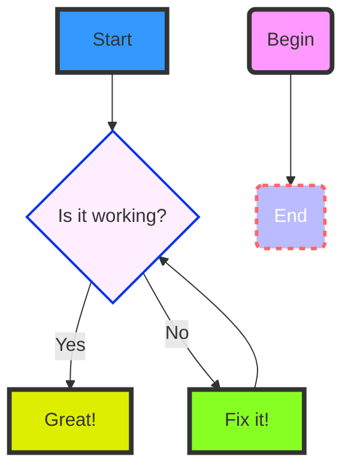

# Squibview Graphical Markdown Editor 

Welcome to the **Squibview** live markdown editor. This document showcases various features such as live preview, Mermaid diagrams, syntax-highlighted code blocks, tables, and inline SVG graphics.

This is a test
of the line feed faeature
lets see how it renders.


[Code is Here on GitHub](www.github.com/deftio/graphics-md-viewer)

Squibview allows live view of source (mixed markdown), rendered (html), or split-view for debugging.  It can be used as a lightweight editor or as a headless component which can be deployed in apps.

The user can edit (live) either the source or rendered content and it will live-update the reciprocal page.  See docs for limitations. Squibview supports running headless (no controls) and can be styled or themed with CSS.

## Diagram Example

Below is a Mermaid diagram demonstrating a simple flow:



## Code Example

Here's a JavaScript code snippet with syntax highlighting:

```javascript
// A simple greeting function
let name="World";
function greet(name) {
    console.log(\`Hello, \${name}!\`);
}

greet("World");

let x = {
      "key one" : "this is a value",
      "many things" : [1,2,3,34],
      "and more" : {
        "x" : 1,
        "y" : 2
      }
}

```

## Basic Table Example

The table below lists some features and their statuses:

| Feature           | Supported |
| ----------------- | --------- |
| Live Preview      | Yes       |
| Mermaid Diagrams  | Yes       |
| Syntax Highlight  | Yes       |
| Table Styling     | Yes       |
| SVG Rendering     | Yes       |


## Inline SVG Example

Below is an inline SVG graphic rendered directly from Markdown:

```svg
<svg width="100" height="100" xmlns="http://www.w3.org/2000/svg">
    <circle cx="50" cy="50" r="40" stroke="green" stroke-width="4" fill="yellow" />
</svg>
```

## CSV / TSV / PSV Support
Squibview allows inline tables via CSV, TSV, or PSV separated entries

### CSV Example

```csv
Name,Age,City
Alice,30,New York
Bob,24,Paris
Charlie,35,London
David,29,Berlin
Eve,42,Tokyo
```

### TSV Example

```tsv
Fruit	Color	Taste
Apple	Red	Sweet
Banana	Yellow	Sweet
Lemon	Yellow	Sour
Orange	Orange	Sweet
Grape	Purple	Sweet
```

### PSV (Pipe-Separated Values) Example

```psv
ID|Product|Price|InStock
101|Laptop|1200|Yes
102|Mouse|25|Yes
103|Keyboard|75|No
104|Monitor|300|Yes
105|Webcam|50|No
```

## Additional Content

You can also include regular text, lists, images, and more:

- Bullet points are supported.
- **Bold** and *italic* text work seamlessly.
- [Links](https://github.com) can be included.

## Image Support

With regular image (md):


Image with embedded html:

