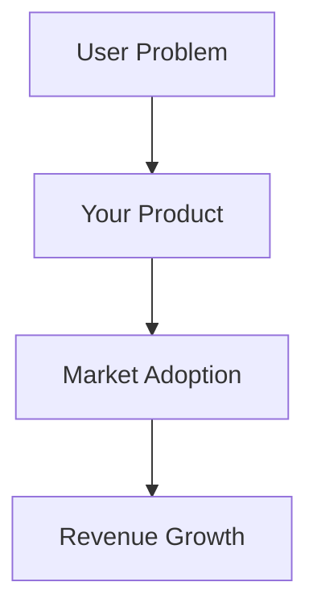
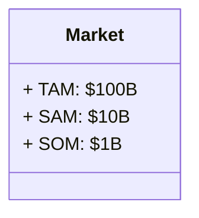
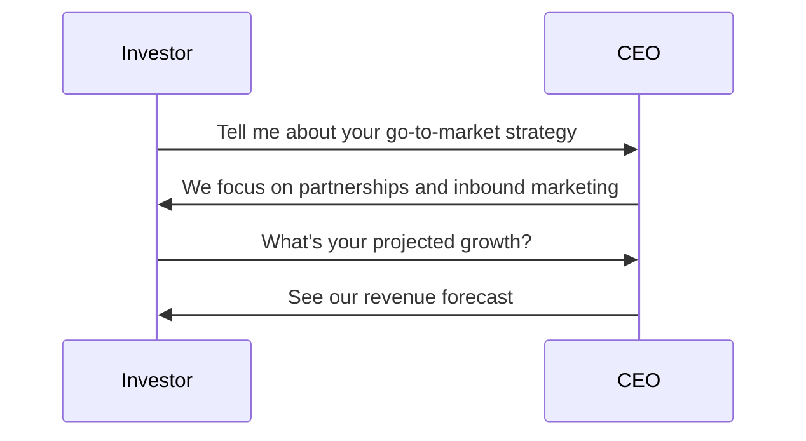

# How to Pitch a Company to a VC
## Introduction
- What is a VC pitch?
- Why it matters?
- Key takeaways from this deck

---

## The Problem
- Clearly define the problem you are solving
- Show evidence and market validation
- Make it relatable

---

## The Solution (Flowchart)

---

## Market Opportunity (Mermaid Table)

---

## Go-To-Market Strategy

---

## Team
Here is the crew that brings you Amazing Co:
<svg width="500" height="200">
  <rect x="10" y="10" width="200" height="100" fill="blue"/>
  <text x="30" y="60" font-size="20" fill="white">Our Core Team</text>
  <text>Billy Bob</text>
  <text>Gloria Sue</text>
  <text>Filo Flip</text>
</svg>

---

## Financials & Ask

- Funding needed and how it will be used
- Growth projections
- Expected ROI for investors

---

## Closing

- Recap the opportunity
- Call to action: "Join us on this journey!"
- Contact details

---

## Q&A
- Open floor for questions

### **How This Works**
✅ **Mermaid.js is enabled** so you can use mermaid tags in your markdown.  
✅ **Mermaid diagrams render automatically** after each slide change.  
✅ **Inline SVGs** are supported directly in the markdown.  

---

### **What This Enables**
- **Flowcharts**
- **Class diagrams**
- **Sequence diagrams**
- **Gantt charts**
- **Entity-relationship diagrams**
- **Custom SVG graphics**

