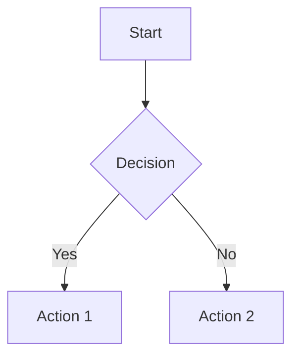

# Basic Usage

This guide covers the fundamental concepts and methods for using SquibView in your projects.

## Creating a SquibView Instance

### Basic Setup

```javascript
const editor = new SquibView({
    element: document.getElementById('editor'),
    content: '# Hello World\n\nThis is **markdown** content.'
});
```

### With Options

```javascript
const editor = new SquibView({
    element: document.getElementById('editor'),
    content: '# My Document',
    initialView: 'split',        // 'src', 'html', or 'split'
    showControls: true,          // Show view toggle buttons
    titleShow: true,             // Show title bar
    titleContent: 'My Editor'    // Title bar text
});
```

## Core Methods

### Setting Content

```javascript
// Set markdown content
editor.setContent('# New Content\n\nThis is **new** content.', 'md');

// Set HTML content
editor.setContent('<h1>HTML Content</h1><p>Direct HTML</p>', 'html');

// Set CSV data
editor.setContent('name,age\nJohn,25\nJane,30', 'csv');
```

### Getting Content

```javascript
// Get current source content
const source = editor.getContent();

// Get rendered HTML
const html = editor.getHTML();

// Check current view mode
const view = editor.getCurrentView(); // 'src', 'html', or 'split'
```

### View Management

```javascript
// Switch views
editor.setView('src');    // Source only
editor.setView('html');   // HTML only  
editor.setView('split');  // Split view

// Toggle between views
editor.toggleView();
```

## Content Types

SquibView supports multiple content types:

| Type | Description | Example |
|------|-------------|---------|
| `md` | Markdown (default) | `# Title\n\n**Bold text**` |
| `html` | Raw HTML | `<h1>Title</h1><p>Text</p>` |
| `csv` | Comma-separated values | `name,age\nJohn,25` |
| `tsv` | Tab-separated values | `name\tage\nJohn\t25` |

### Markdown Features

SquibView supports GitHub-Flavored Markdown including:

- **Headers** (`# ## ###`)
- **Emphasis** (`**bold**`, `*italic*`)
- **Lists** (ordered and unordered)
- **Tables** (with alignment)
- **Code blocks** (with syntax highlighting)
- **Links and images**
- **Blockquotes**

### Special Content Blocks

#### Mermaid Diagrams
```markdown


#### Math Equations
```markdown
Inline math: $E = mc^2$

Block math:
$$
\frac{-b \pm \sqrt{b^2 - 4ac}}{2a}
$$
```

#### Code with Syntax Highlighting
```markdown
```javascript
function hello() {
    console.log('Hello, World!');
}
```

#### GeoJSON Maps
```markdown
```geojson
{
  "type": "Feature",
  "geometry": {
    "type": "Point",
    "coordinates": [-74.0445, 40.6892]
  },
  "properties": {
    "name": "Statue of Liberty"
  }
}
```

## Event Handling

SquibView uses an event system for communication:

```javascript
// Listen for content changes
editor.on('content-changed', (content, type) => {
    console.log('Content updated:', content);
});

// Listen for view changes
editor.on('view-changed', (view) => {
    console.log('View changed to:', view);
});

// Listen for selection changes
editor.on('selection-changed', (selection) => {
    console.log('Selected text:', selection.text);
});
```

## Export and Copy

### Copy to Clipboard

```javascript
// Copy HTML to clipboard
editor.copyHTML();

// Copy source to clipboard
editor.copySource();
```

### Export Content

```javascript
// Get clean HTML for export
const exportHTML = editor.getHTML();

// Get current source content
const exportSource = editor.getContent();
```

## Styling and Customization

### Custom CSS

```css
/* Override default styles */
.squibview {
    font-family: 'Custom Font', serif;
}

.squibview .source-panel {
    background-color: #f5f5f5;
}

.squibview .html-panel {
    background-color: white;
}
```

### Responsive Design

SquibView automatically adapts to different screen sizes:

```css
/* Mobile-first styling */
.squibview {
    height: 400px;
}

@media (min-width: 768px) {
    .squibview {
        height: 600px;
    }
}
```

## Best Practices

1. **Initialize after DOM is ready**
   ```javascript
   document.addEventListener('DOMContentLoaded', () => {
       const editor = new SquibView({ /* options */ });
   });
   ```

2. **Handle errors gracefully**
   ```javascript
   try {
       editor.setContent(userContent, contentType);
   } catch (error) {
       console.error('Failed to set content:', error);
   }
   ```

3. **Clean up when done**
   ```javascript
   // If your framework supports cleanup
   editor.destroy?.();
   ```

## Next Steps

- **[CLI Usage](./04-cli-usage.md)** - Learn about the command-line interface
- **[Graphical Content](../features/02-graphical-content.md)** - Explore visual features
- **[API Reference](../api/01-options.md)** - Complete options documentation