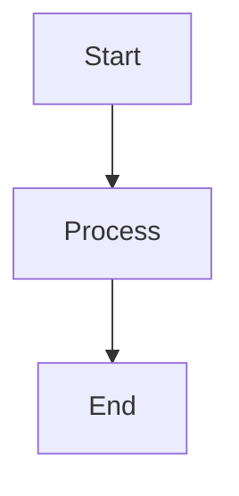

# CLI Usage Guide

The SquibView CLI (`squibv`) converts Markdown files into high-quality HTML documents with full support for math, diagrams, and interactive content.

## Quick Start

```bash
# Convert a markdown file to HTML
npx squibv document.md

# Specify output file
npx squibv document.md -o output.html

# Create offline-ready HTML
npx squibv document.md --bundle-offline
```

## Installation Options

### NPX (Recommended)
```bash
# No installation required
npx squibv document.md
```

### Global Installation
```bash
npm install -g squibview
squibv document.md
```

### Project Installation
```bash
npm install squibview
npx squibv document.md
```

## Command Syntax

```bash
squibv [options] [file]
squibv [options] build [file]  # Explicit build command
```

## Options Reference

| Option | Short | Description | Default |
|--------|-------|-------------|---------|
| `--input <source>` | `-i` | Input file or "-" for stdin | Positional arg |
| `--output <dest>` | `-o` | Output file or "-" for stdout | `input.html` |
| `--standalone` | `-s` | Self-contained HTML (default) | `true` |
| `--css <file>` | | Custom CSS file | Built-in styles |
| `--bundle-offline` | | Bundle all dependencies | CDN links |
| `--watch` | `-w` | Watch for changes | Off |
| `--quiet` | | Suppress progress messages | Off |
| `--log <file>` | | Log file for messages | stderr |

## Examples

### Basic Conversion
```bash
# Convert README.md to README.html
squibv README.md

# Custom output name
squibv README.md -o documentation.html

# Read from stdin
echo "# Hello World" | squibv -i - -o output.html
```

### Advanced Features
```bash
# Bundle for offline use (larger file, no internet required)
squibv document.md --bundle-offline -o standalone.html

# Custom styling
squibv document.md --css custom-theme.css -o styled.html

# Development mode with auto-rebuild
squibv document.md --watch

# Quiet mode (suppress progress)
squibv document.md --quiet -o output.html
```

### Batch Processing
```bash
# Convert multiple files
for file in *.md; do
    squibv "$file" -o "${file%.md}.html"
done

# Using find
find . -name "*.md" -exec squibv {} -o {}.html \;
```

## Output Options

### Standalone vs Regular
- **Standalone (default)**: Creates self-contained HTML with embedded CSS and CDN links
- **Regular**: Minimal HTML that requires external stylesheets

### Offline Bundling
The `--bundle-offline` option creates fully self-contained files:

```bash
squibv document.md --bundle-offline
```

**Benefits:**
- Works without internet connection
- Guaranteed to work in any environment
- All dependencies included

**Tradeoffs:**
- Larger file size (~4MB+)
- Longer build time

## Content Support

### Markdown Features
- GitHub-Flavored Markdown
- Tables with alignment
- Task lists
- Syntax highlighting
- Emoji support

### Enhanced Content
- **Math**: LaTeX equations with MathJax
- **Diagrams**: Mermaid flowcharts, sequences, etc.
- **Maps**: GeoJSON and TopoJSON rendering
- **3D Models**: STL file visualization
- **Data**: CSV/TSV table rendering
- **Graphics**: SVG and ASCII-art conversion

### Example Content
```markdown
# Sample Document

## Math
$$E = mc^2$$

## Diagram


## Data
```csv
name,age,city
John,25,NYC
Jane,30,LA
```

## Code
```javascript
console.log('Hello, World!');
```
```

## Custom Styling

### Using Custom CSS
```bash
squibv document.md --css custom.css
```

### CSS File Example
```css
/* custom.css */
body {
    font-family: 'Georgia', serif;
    max-width: 800px;
    margin: 0 auto;
    padding: 2rem;
}

h1 {
    color: #2c3e50;
    border-bottom: 2px solid #3498db;
}

.squibview-data-table {
    border-collapse: collapse;
    width: 100%;
}

.squibview-data-table th,
.squibview-data-table td {
    border: 1px solid #ddd;
    padding: 8px;
    text-align: left;
}
```

## Watch Mode

Monitor files for changes and auto-rebuild:

```bash
# Watch single file
squibv document.md --watch

# Watch with custom output
squibv document.md --watch -o docs/output.html
```

Perfect for development workflows where you want live updates.

## Pipeline Integration

### CI/CD Usage
```yaml
# GitHub Actions example
- name: Generate Documentation
  run: npx squibv README.md -o docs/index.html --bundle-offline
```

### Makefile Integration
```makefile
docs: README.md
	npx squibv README.md -o docs/index.html

.PHONY: docs
```

## Troubleshooting

### Common Issues

**File not found:**
```bash
# Check file path
ls -la document.md
squibv document.md
```

**Permission errors:**
```bash
# Check write permissions
ls -la output-directory/
```

**Large file warnings:**
```bash
# For large files, increase memory if needed
NODE_OPTIONS="--max-old-space-size=4096" squibv large-document.md
```

### Logging
```bash
# Enable detailed logging
squibv document.md --log build.log

# Check log file
cat build.log
```

## Next Steps

- **[Graphical Content](../features/02-graphical-content.md)** - Learn about visual features
- **[API Reference](../api/01-options.md)** - Programmatic usage
- **[Examples](../../examples/)** - See real-world usage examples