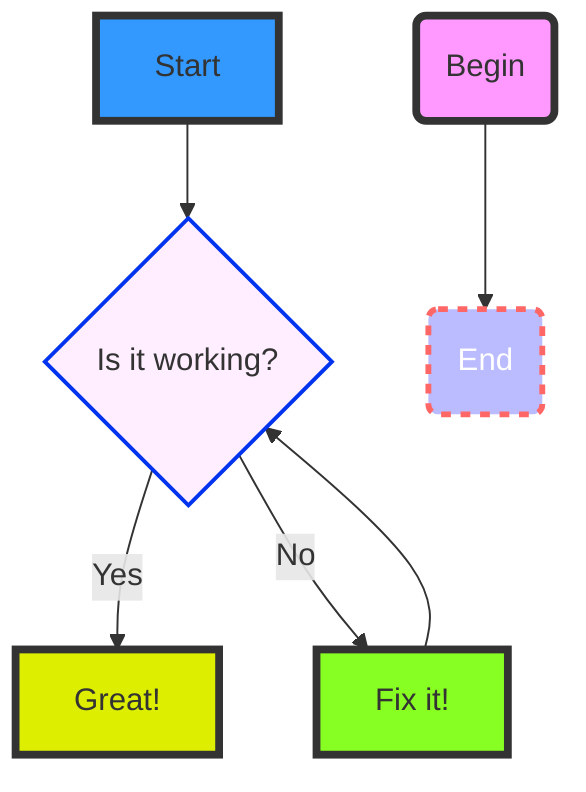

# Markdown Viewer with Graphics Support

Welcome to the **Graphical Markdown Converter** demo. This document showcases various features such as live preview, Mermaid diagrams, syntax-highlighted code blocks, tables, and inline SVG graphics.

[Code is Here on GitHub](www.github.com/deftio/graphics-md-viewer)
## Diagram Example

Below is a Mermaid diagram demonstrating a simple flow:



## Code Example

Here's a JavaScript code snippet with syntax highlighting:

```javascript
// A simple greeting function
let name="World";
function greet(name) {
    console.log(\`Hello, \${name}!\`);
}

greet("World");

let x = {
      "key one" : "this is a value",
      "many things" : [1,2,3,34],
      "and more" : {
        "x" : 1,
        "y" : 2
      }
}

```

## Table Example

The table below lists some features and their statuses:

| Feature           | Supported |
| ----------------- | --------- |
| Live Preview      | Yes       |
| Mermaid Diagrams  | Yes       |
| Syntax Highlight  | Yes       |
| Table Styling     | Yes       |
| SVG Rendering     | Yes       |

## Inline SVG Example

Below is an inline SVG graphic rendered directly from Markdown:

```svg
<svg width="100" height="100" xmlns="http://www.w3.org/2000/svg">
    <circle cx="50" cy="50" r="40" stroke="green" stroke-width="4" fill="yellow" />
</svg>
```

## Additional Content

You can also include regular text, lists, images, and more:

- Bullet points are supported.
- **Bold** and *italic* text work seamlessly.
- [Links](https://github.com) can be included.

## Image Support

With regular image (md):


Image with embedded html:

